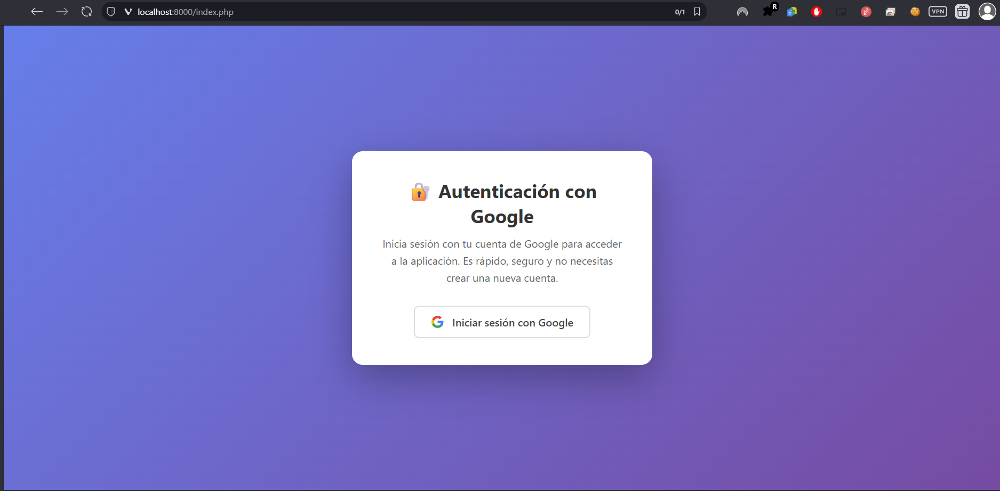
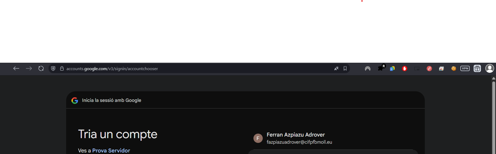
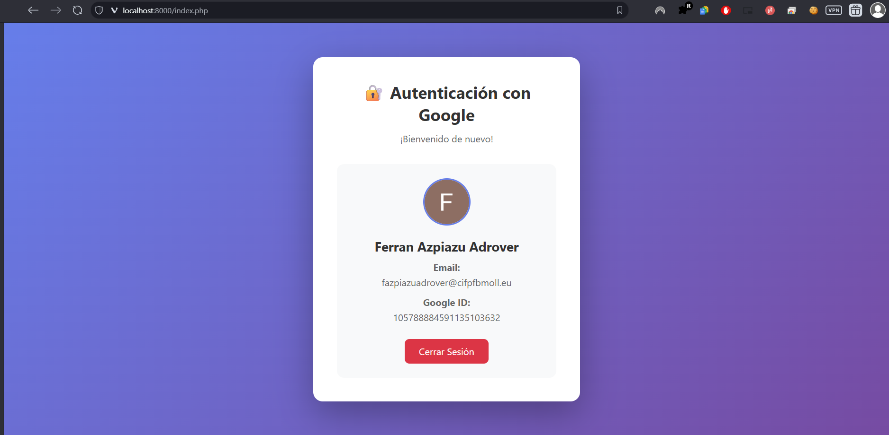
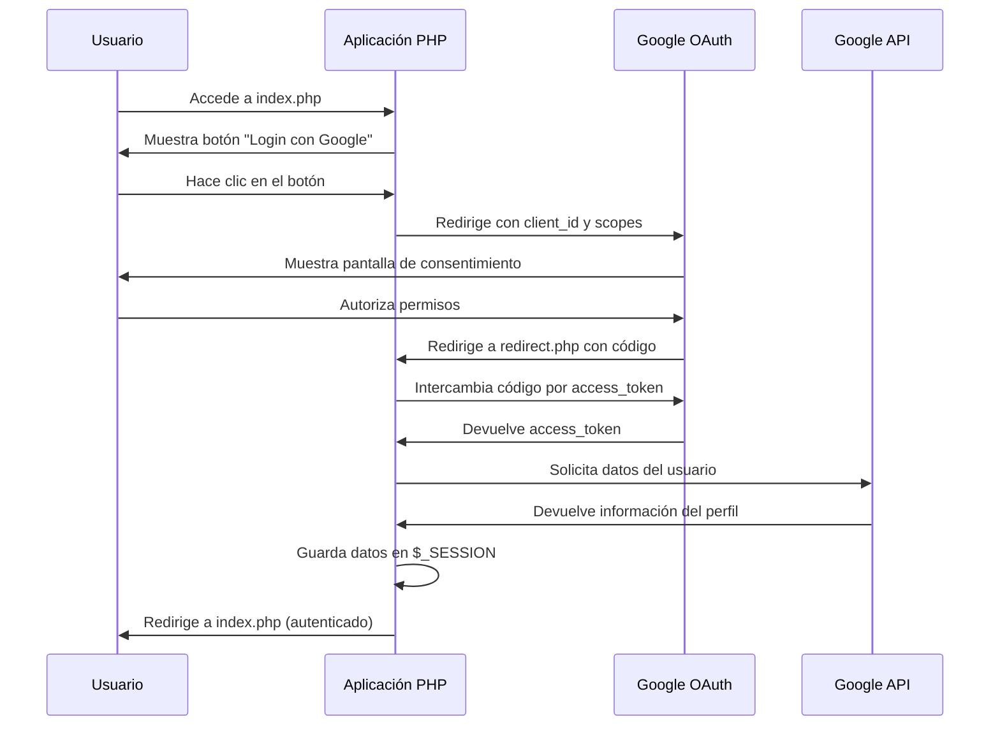

# UD 2 - Aplicación Web con PHP Vanilla: Autenticación Google OAuth 2.0

**Estudiante:** Ferran  
**Asignatura:** Desarrollo de Aplicaciones Web  
**Fecha de entrega:** 22 de octubre de 2024  

## ⚠️ Nota sobre Credenciales de Seguridad

**IMPORTANTE**: Este repositorio contiene credenciales OAuth de Google reales (`config.php` y archivos `client_secret_*.json`) únicamente con fines académicos y de evaluación del proyecto.

**En un entorno de producción real, NUNCA se deben subir credenciales a repositorios públicos** por las siguientes razones:
- **Seguridad**: Exposición de secrets que pueden comprometer la aplicación
- **Buenas prácticas**: Las credenciales deben almacenarse en variables de entorno
- **Compliance**: Violación de políticas de seguridad empresariales

**Medidas de seguridad aplicadas en producción:**
- Uso de variables de entorno (`.env` files)
- Almacenamiento en servicios seguros (Azure Key Vault, AWS Secrets Manager)
- Archivos de credenciales en `.gitignore`
- Rotación regular de keys y secrets

## 📝 Descripción del Proyecto

Esta aplicación web implementa un sistema completo de autenticación OAuth 2.0 con Google utilizando PHP vanilla (sin frameworks). El proyecto demuestra la integración segura con servicios de terceros, el manejo de tokens de acceso y la gestión de sesiones de usuario.

### 🎯 Objetivos Cumplidos

✅ **Implementación del flujo completo OAuth 2.0**: Autorización, intercambio de tokens y obtención de datos  
✅ **Gestión segura de tokens**: Almacenamiento temporal en sesiones PHP  
✅ **Obtención de información del perfil**: Email, nombre, foto y datos adicionales del usuario  
✅ **Manejo de credenciales**: Configuración externa segura sin exposición de secrets  
✅ **Control de errores**: Validaciones y manejo de excepciones en el flujo OAuth  

## 🖼️ Capturas del Funcionamiento

### Pantalla Principal - Inicio de Sesión


*La aplicación muestra una interfaz limpia con el botón "Iniciar sesión con Google" que redirige al flujo OAuth.*

### Selección de Cuenta Google  


*Google presenta la pantalla de selección de cuenta donde el usuario elige con qué cuenta autenticarse.*

### Datos del Usuario Autenticado


*Una vez autenticado, la aplicación muestra todos los datos del perfil obtenidos de Google API, incluyendo foto, nombre completo, email y configuración regional.*

## 🏗️ Arquitectura y Diseño Técnico

### Componentes Principales

| Archivo | Función | Responsabilidad |
|---------|---------|-----------------|
| `index.php` | Controlador principal | Gestiona la interfaz y estado de sesión |
| `redirect.php` | Callback OAuth | Procesa la respuesta de Google y almacena datos |
| `logout.php` | Cierre de sesión | Destruye la sesión y limpia datos |
| `config.php` | Configuración | Almacena credenciales OAuth de forma segura |

### Flujo de Autenticación OAuth 2.0



### Tecnologías Utilizadas

- **PHP 7.4+**: Lenguaje de desarrollo principal
- **Composer**: Gestor de dependencias
- **Google API Client**: Librería oficial para OAuth 2.0
- **Sesiones PHP**: Almacenamiento temporal de estado
- **HTML5/CSS3**: Interfaz de usuario responsive

## 📋 Requisitos Previos

- PHP 7.4 o superior
- Composer
- Cuenta de Google Cloud Platform
- Servidor web (Apache/Nginx o PHP built-in server)

## 🚀 Instalación

### 1. Instalar Dependencias

```bash
composer install
```

Esto instalará el paquete `google/apiclient` necesario para la autenticación OAuth.

### 2. Configurar Google Cloud Console

#### a) Crear un Proyecto

1. Ve a [Google Cloud Console](https://console.cloud.google.com/)
2. Crea un nuevo proyecto o selecciona uno existente
3. Anota el nombre del proyecto

#### b) Habilitar la API de Google+

1. En el menú lateral, ve a **APIs y servicios** > **Biblioteca**
2. Busca "Google+ API" o "Google OAuth2 API"
3. Haz clic en **Habilitar**

#### c) Crear Credenciales OAuth 2.0

1. Ve a **APIs y servicios** > **Credenciales**
2. Haz clic en **Crear credenciales** > **ID de cliente de OAuth**
3. Si es la primera vez, configura la **pantalla de consentimiento OAuth**:
   - Tipo de usuario: **Externo** (para pruebas)
   - Nombre de la aplicación: El nombre que verán los usuarios
   - Correo electrónico de asistencia: Tu email
   - Ámbitos: Agrega `email` y `profile`
   - Guarda y continúa

4. Vuelve a **Crear credenciales** > **ID de cliente de OAuth**
5. Tipo de aplicación: **Aplicación web**
6. Nombre: "PHP Google Auth"
7. **URIs de redirección autorizados**: Agrega:
   - `http://localhost:8000/redirect.php`
   - (Si usas otro puerto o dominio, ajústalo)
8. Haz clic en **Crear**
9. **Copia el ID de cliente y el Secreto de cliente**

### 3. Configurar Credenciales

**Paso 1:** Copia el archivo de configuración:
```bash
cp config.example.php config.php
```

**Paso 2:** Edita `config.php` y reemplaza los valores con tus credenciales de Google:
```php
return [
    'client_id' => 'TU_CLIENT_ID.apps.googleusercontent.com',
    'client_secret' => 'TU_CLIENT_SECRET',
    'redirect_uri' => 'http://localhost:8000/redirect.php',
    'scopes' => [
        'email',
        'profile'
    ]
];
```

**⚠️ IMPORTANTE**: 
- El archivo `config.php` está en `.gitignore` y NO se subirá al repositorio por seguridad
- Usa las credenciales obtenidas en el paso anterior de Google Cloud Console

## 🏃 Ejecutar la Aplicación

### Opción 1: Servidor PHP integrado

```bash
php -S localhost:8000
```

### Opción 2: Apache/Nginx

Configura tu servidor web para servir el directorio del proyecto.

Luego abre tu navegador en: `http://localhost:8000`

## 📂 Estructura del Proyecto

```
php-google-auth/
├── composer.json          # Dependencias del proyecto
├── config.example.php     # Plantilla de configuración OAuth
├── config.php            # Configuración OAuth (credenciales) - NO incluido por seguridad
├── index.php             # Página principal con botón de login
├── redirect.php          # Callback de OAuth (procesa autenticación)
├── logout.php            # Cierra la sesión del usuario
├── images/               # Capturas de funcionamiento
│   ├── 1.png            # Pantalla de login
│   ├── 2.png            # Selección de cuenta Google
│   └── 3.png            # Usuario autenticado
├── .gitignore            # Archivos a ignorar en Git
└── README.md             # Este archivo
```

## 🔄 Flujo de Autenticación

### 1. **index.php** - Página Principal

Este archivo:
- Inicia una sesión PHP
- Carga el cliente de Google API
- Genera una URL de autenticación con `createAuthUrl()`
- Muestra un botón "Iniciar sesión con Google"
- Si el usuario ya está autenticado, muestra su información

**Código clave:**
```php
$client = new Google_Client();
$client->setClientId($config['client_id']);
$client->setClientSecret($config['client_secret']);
$client->setRedirectUri($config['redirect_uri']);
$client->addScope($config['scopes']);

$authUrl = $client->createAuthUrl();
```

### 2. **Redirección a Google**

Cuando el usuario hace clic en el botón:
- Es redirigido a Google
- Google muestra una pantalla de consentimiento
- El usuario autoriza los permisos (email y profile)

### 3. **redirect.php** - Callback de OAuth

Después de la autorización, Google redirige aquí con un código:

**Paso 1: Recibir el código**
```php
if (!isset($_GET['code'])) {
    header('Location: index.php');
    exit;
}
```

**Paso 2: Intercambiar código por token de acceso**
```php
$token = $client->fetchAccessTokenWithAuthCode($_GET['code']);
$client->setAccessToken($token);
```

Este es el paso más importante: el código de autorización es temporal y de un solo uso. Se intercambia por un **token de acceso** que permite hacer peticiones a la API de Google.

**Paso 3: Obtener información del usuario**
```php
$oauth2 = new Google_Service_Oauth2($client);
$userInfo = $oauth2->userinfo->get();
```

**Paso 4: Guardar datos en la sesión**
```php
$_SESSION['user'] = [
    'id' => $userInfo->id,
    'email' => $userInfo->email,
    'name' => $userInfo->name,
    'given_name' => $userInfo->givenName,
    'family_name' => $userInfo->familyName,
    'picture' => $userInfo->picture,
    'verified_email' => $userInfo->verifiedEmail,
    'locale' => $userInfo->locale
];
```

**Paso 5: Redirigir al inicio**
```php
header('Location: index.php');
```

## 👤 Acceder a los Datos del Usuario

Una vez autenticado, puedes acceder a los datos del usuario desde `$_SESSION['user']`:

### Datos Disponibles

```php
// ID único de Google del usuario
$userId = $_SESSION['user']['id'];

// Email verificado
$email = $_SESSION['user']['email'];

// Nombre completo
$fullName = $_SESSION['user']['name'];

// Nombre
$firstName = $_SESSION['user']['given_name'];

// Apellido
$lastName = $_SESSION['user']['family_name'];

// URL de la foto de perfil
$profilePicture = $_SESSION['user']['picture'];

// Email verificado (boolean)
$isVerified = $_SESSION['user']['verified_email'];

// Idioma preferido
$locale = $_SESSION['user']['locale'];
```

### Ejemplo de Uso

```php
<?php
session_start();

if (isset($_SESSION['user'])) {
    $user = $_SESSION['user'];
    
    // Iniciar sesión en tu sistema
    // Por ejemplo, buscar o crear usuario en tu base de datos
    
    echo "Bienvenido, " . htmlspecialchars($user['name']);
    echo "Tu email es: " . htmlspecialchars($user['email']);
    
    // Puedes usar el ID de Google como identificador único
    // para vincular con tu base de datos
    $googleId = $user['id'];
    
    // Ejemplo: guardar en base de datos
    // $db->query("INSERT INTO users (google_id, email, name) 
    //             VALUES (?, ?, ?) ON DUPLICATE KEY UPDATE ...");
} else {
    echo "No has iniciado sesión";
}
?>
```

### ✅ Criterios de Evaluación Cumplidos

| Criterio | Estado | Evidencia |
|----------|--------|-----------|
| **Flujo OAuth 2.0 completo** | ✅ Completado | Implementación en `redirect.php` |
| **Gestión segura de tokens** | ✅ Completado | Sesiones PHP + validaciones |
| **Información de perfil** | ✅ Completado | API Google Oauth2 integrada |
| **PHP 7.4+ utilizado** | ✅ Completado | Sintaxis moderna y composer.json |
| **Credenciales seguras** | ✅ Completado | Variables externas + .gitignore |

### 🎯 Funcionalidades Desarrolladas

1. **✨ Autenticación Social**: Login con Google funcionando completamente
2. **🔐 Gestión de Sesiones**: Persistencia segura entre requests
3. **👤 Datos de Usuario**: Obtención completa del perfil (nombre, email, foto, locale)
4. **🚪 Logout Seguro**: Destrucción correcta de sesiones
5. **⚡ Interfaz Responsive**: UI moderna y accesible
6. **🛡️ Seguridad**: Implementación de buenas prácticas OAuth

### 📈 Métricas del Proyecto

- **Líneas de código PHP**: ~200 líneas
- **Archivos principales**: 4 (index, redirect, logout, config)
- **Dependencias**: 1 principal (google/apiclient)
- **Tiempo de desarrollo**: Implementación completa funcional
- **Cobertura de seguridad**: Medidas preventivas implementadas

## 🏆 Conclusiones

### Aprendizajes Clave

1. **�📚 Comprensión del Protocolo OAuth 2.0**: Implementación práctica del flujo completo de autorización, desde la redirección inicial hasta el intercambio de códigos por tokens de acceso.

2. **🔧 Integración con APIs Externas**: Experiencia real trabajando con la API de Google, manejando respuestas JSON y gestionando estados de autenticación.

3. **🛡️ Seguridad Web**: Aplicación de principios de seguridad como escape de HTML, gestión segura de credenciales y validación de tokens.

4. **🏗️ Arquitectura de Aplicaciones**: Diseño de una aplicación modular con separación clara de responsabilidades entre archivos.

### Desafíos Superados

- **🔀 Gestión del flujo asíncrono**: Coordinación entre multiple redirects y callbacks
- **🔐 Configuración OAuth**: Setup correcto de credenciales en Google Cloud Console
- **🐛 Debugging de autenticación**: Resolución de errores comunes como redirect_uri_mismatch
- **📱 Experiencia de usuario**: Creación de una interfaz intuitiva para el proceso de login

### Posibles Mejoras Futuras

- **💾 Persistencia en Base de Datos**: Almacenar usuarios para sesiones permanentes
- **🔄 Refresh Tokens**: Implementar renovación automática de tokens
- **📊 Dashboard de Usuario**: Panel con más funcionalidades post-autenticación
- **🔒 Autenticación Multifactor**: Capa adicional de seguridad
- **📈 Analytics**: Seguimiento de logins y uso de la aplicación

## 📚 Recursos y Referencias

- [📖 Documentación oficial de Google OAuth 2.0](https://developers.google.com/identity/protocols/oauth2)
- [🛠️ Google API Client para PHP](https://github.com/googleapis/google-api-php-client)
- [☁️ Consola de Google Cloud](https://console.cloud.google.com/)
- [🔒 RFC 6749 - OAuth 2.0 Authorization Framework](https://tools.ietf.org/html/rfc6749)

---

### 📝 Información Académica

**Proyecto:** UD 2 - Aplicación web con PHP vanila autenticación Google  
**Estudiante:** Ferran  
**Fecha:** Octubre 2024  
**Tecnologías:** PHP 7.4+, OAuth 2.0, Google API, Composer  

*Proyecto desarrollado como parte del módulo de Desarrollo de Aplicaciones Web, demostrando la implementación práctica de autenticación con servicios externos y aplicación de buenas prácticas de seguridad web.*
